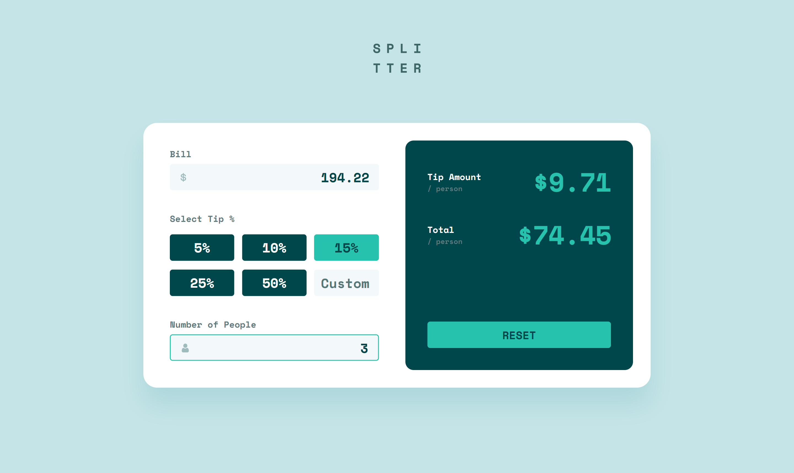

 <h1>Tip calculator app</h1>

This is my first project using Javascript and it helped me   understand fundamentals of DOM and Event Handlers.

[Live URL](https://ivaberiashvili.github.io/tip-calculator-app/) | [Solution]() | [Challenge on Frontend Mentor](https://www.frontendmentor.io/challenges/tip-calculator-app-ugJNGbJUX)
:-------------------------:|:-------------------------:|:-------------------------:

## The challenge

Users should be able to:
- View the optimal layout for the app depending on their device's screen size
- See hover states for all interactive elements on the page
- Calculate the correct tip and total cost of the bill per person

Bonus:
- I added the extra functionality - the buttons  have two different color mode depending on if all the inputs are filled out or not.

## The Solution
Desktop             |  Mobile
:-------------------------:|:-------------------------:
  |  

### Built with

- Semantic HTML5 markup
- CSS custom properties
- Flexbox
- CSS Grid
- Mobile-first workflow
- DOM

### Author
- [Iva](https://github.com/ivaberiashvili/)

